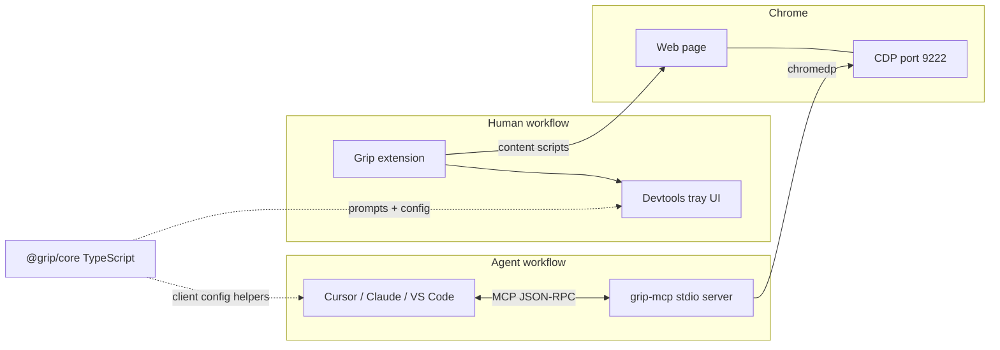

# Grip MCP architecture

Grip connects **human-in-the-loop element picking** (browser extension) with **agent-driven browser automation** (MCP server). The two halves share Chrome remote debugging but use different protocols on the wire.

## Overview



| Layer | Package | Role |
|-------|---------|------|
| **MCP server** | `packages/mcp-server` (Go) | stdio MCP server; 10 tools over CDP |
| **MCP client utilities** | `@grip/core/mcp` (npm) | Config snippets, port check, pick → prompt formatting |
| **Extension UI** | `@grip/devtools` | MCP badge, copy prompts, Chrome debug status |
| **Docs** | `apps/docs` | Per-IDE setup guides |

There is **no direct protocol link** between the extension and grip-mcp today. Both attach to the same debug Chrome instance. The extension produces structured pick context; the agent uses grip-mcp tools to act on the live page.

## MCP server (grip-mcp)

- **Transport**: stdio only (no HTTP/SSE)
- **SDK**: [modelcontextprotocol/go-sdk](https://github.com/modelcontextprotocol/go-sdk)
- **Browser**: [chromedp](https://github.com/chromedp/chromedp) → `http://127.0.0.1:{port}/json`

### Tools

Registered in `packages/mcp-server/internal/tools/register.go`:

| Tool | Purpose |
|------|---------|
| `snapshot` | Accessibility tree + stable refs for the active page |
| `highlight` | Visual overlay for a ref before interaction |
| `click` | Click element by ref |
| `fill` | Set input value by ref |
| `read_logs` | Console logs from the page |
| `read_network` | HAR-style network entries |
| `screenshot` | PNG capture |
| `pick_element` | Programmatic pick at coordinates |
| `navigate` | Go to URL |
| `eval` | Run JavaScript in page context |

### Environment

| Variable | Default | Description |
|----------|---------|-------------|
| `GRIP_CHROME_PORT` | `9222` | Chrome remote debugging port |
| `GRIP_LOG_LEVEL` | `info` | Server log level (`debug`, `info`, `warn`, `error`) |

CLI flag `--port` also sets the CDP port (see `.cursor/mcp.json` for combined `args` + `env` pattern).

### Build & run

```bash
# From repo root
pnpm run build:mcp          # → bin/grip-mcp

# Chrome (example)
google-chrome --remote-debugging-port=9222

# MCP client config (Cursor)
# .cursor/mcp.json → "${workspaceFolder}/bin/grip-mcp"
```

## MCP client (@grip/core)

Published npm package with a dedicated subpath:

```ts
import {
  GRIP_MCP_TOOLS,
  createGripMcpClientConfig,
  formatMcpPrompt,
  checkChromeDebugPort,
} from "@grip/core/mcp";
```

### Responsibilities

1. **Config generation** — `createGripMcpClientConfig(rootKey, options)` for `mcpServers`, `servers`, `context_servers`, and OpenCode-style `mcp` roots.
2. **Pick → agent prompt** — `formatMcpPrompt()` / `formatAllMcpPrompts()` embed CSS/XPath, a11y metadata, and suggested grip-mcp workflow steps.
3. **Preflight** — `checkChromeDebugPort()` hits `/json/version` before agents start.
4. **Tool catalog** — `GRIP_MCP_TOOLS` mirrors the Go server (keep in sync with `register.go`).

### Suggested agent workflow

After a human pick, agents should:

1. `snapshot()` — refresh refs on the current page
2. `highlight(ref)` — confirm target visually
3. `click(ref)` / `fill(ref, value)` — interact
4. `read_logs()` — verify side effects

If navigation invalidates refs, call `snapshot()` again. CSS/XPath from the extension are fallbacks when MCP refs expire.

## Extension integration

`@grip/devtools` surfaces MCP in the tray:

- Chrome debug port status (`checkChromeDebugPort`)
- Copy MCP prompt for the active pick
- Link to MCP setup docs (`GRIP_MCP_DOCS_URL`)

The extension does **not** speak MCP. It prepares context for external agents that connect to grip-mcp separately.

## Known gaps & future work

| Gap | Notes |
|-----|-------|
| No extension ↔ MCP handshake | Shared CDP only; no session or tab ID exchange |
| Duplicated snapshot logic | Go (`internal/cdp`) vs TS (`buildSnapshot`) — same goals, different runtimes |
| No tab targeting in MCP | Server uses default target; multi-tab workflows need explicit tab selection |
| `frameId` in snapshot | Passed but not fully utilized for iframe depth |
| stdio-only transport | Remote/cloud agents need a hosted MCP gateway |
| Docs URL | `GRIP_MCP_DOCS_URL` points at local docs in dev; use deployed docs URL in production builds |

## Client setup references

- Repo: `.cursor/mcp.json`
- Docs app: `apps/docs/lib/mcp-clients.ts` (per-IDE snippets)
- Programmatic: `@grip/core/mcp` `formatGripMcpClientConfig()`

## Related files

```
packages/mcp-server/          # Go MCP server
packages/core/src/mcp/        # Client utilities (npm)
packages/core/src/mcp-prompt.ts
packages/devtools/            # Tray MCP UI
apps/docs/app/docs/mcp/       # User-facing setup pages
.cursor/mcp.json              # Cursor project config
```
